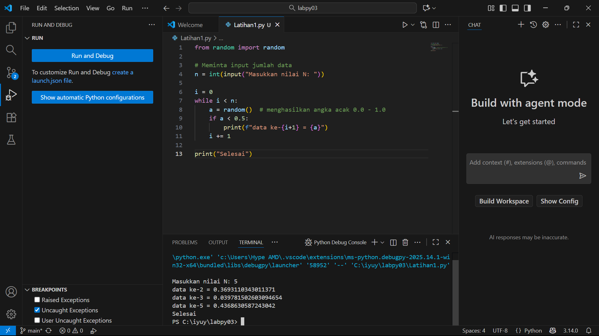
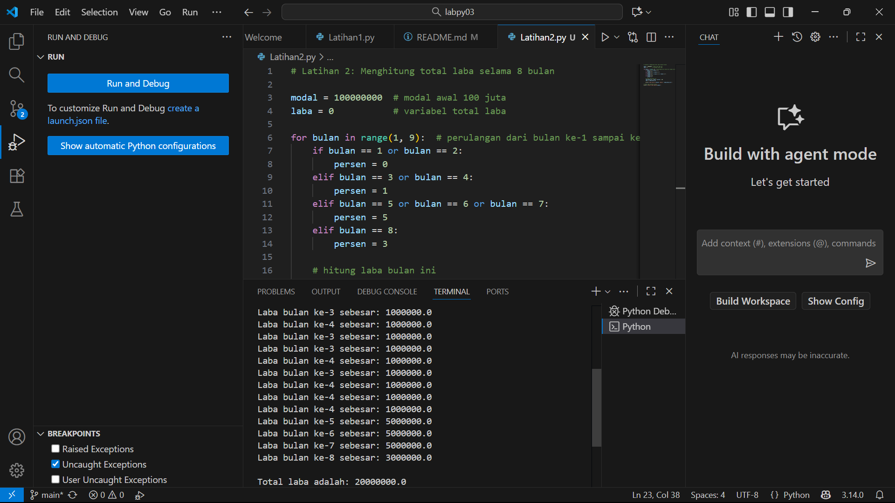

# labpy03
## Latihan 1.py
Penjelasan:

1. from random import random → untuk mengimpor fungsi random() dari modul random.

2. n = int(input(...)) → meminta jumlah data yang ingin ditampilkan.

3. Menggunakan while loop dengan variabel i sebagai penghitung.

4. Setiap perulangan menghasilkan satu angka acak (a = random()).

5. Jika angka tersebut lebih kecil dari 0.5, maka angka ditampilkan.

6. Setelah selesai, program mencetak "Selesai".
### secreenshot

## Latihan2.py
Penjelasan:

1. Modal awal: Rp 100.000.000

2. Persentase laba:

Bulan 1–2 → 0%

Bulan 3–4 → 1%

Bulan 5–7 → 5%

Bulan 8 → 3%

3. Menggunakan perulangan for dari 1 sampai 8.

4. Menghitung laba tiap bulan dan menampilkannya.

5. Menjumlahkan seluruh laba hingga bulan ke-8.
### secreenshot
